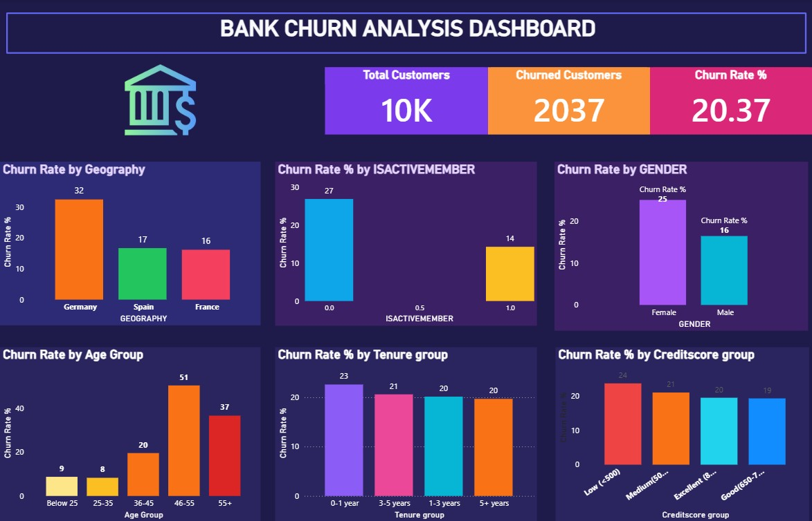

# 📊 Bank Churn Analysis

## 📌 Project Overview
This project analyzes customer churn in a bank to understand why customers are leaving.

## 🛠 Tools Used
- SQL
- Excel
- Power BI

## 📂 Dataset
The dataset contains customer details such as age, balance, credit score, geography, and activity status.

## 📊 Key Insights
- Customers with low balance are more likely to churn
- Inactive customers have higher churn rate
- Germany has higher churn compared to other regions
- Middle-aged customers show significant churn behavior

## 📈 Dashboard

## 💡 Conclusion
The bank should focus on improving customer engagement, especially for inactive users and low-balance customers, to reduce churn.
